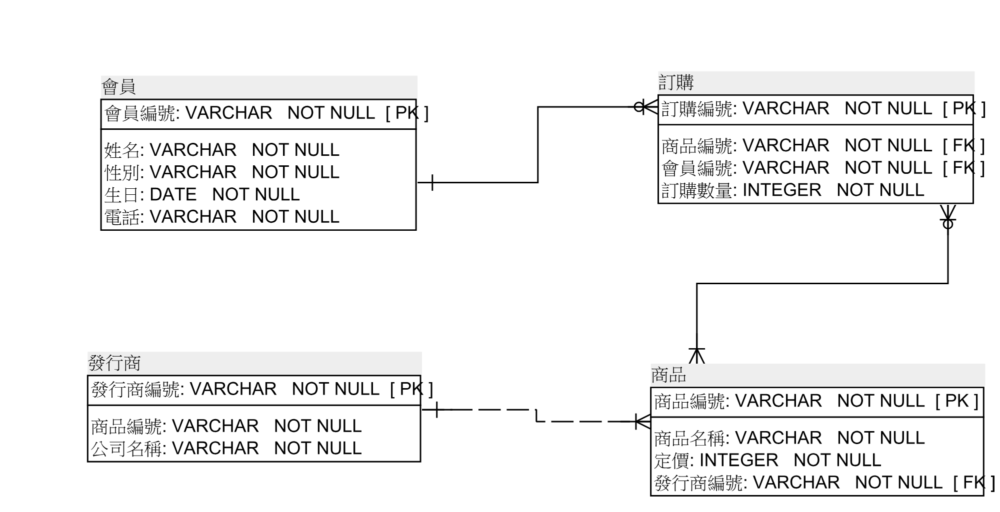
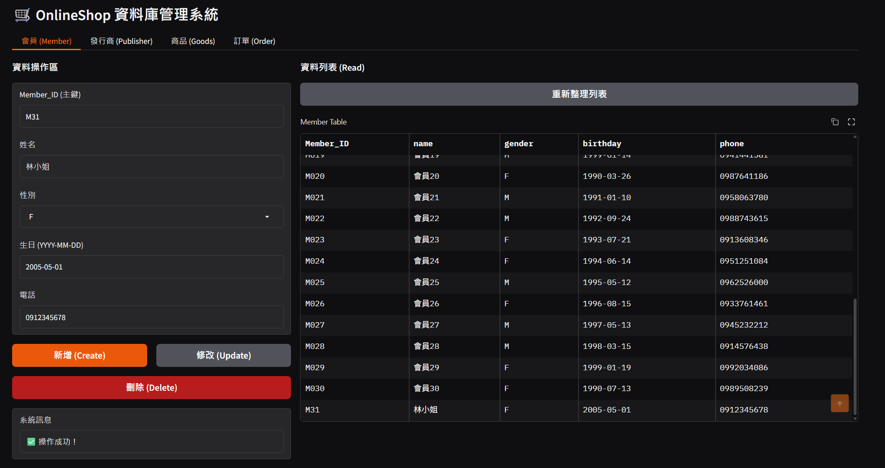

# SQL-course｜資料庫課程專案

這個倉庫是我在資料庫課程中的專案成果，主軸為 **OnlineShop 電商情境**，從需求分析一路做到 SQL Server 進階功能與 Python 整合應用。

## 我在這個專案中完成的內容

- 需求分析、ERM 建模與正規化
- 建立實體資料庫、資料表與測試資料
- 撰寫預存程序（Stored Procedure）處理報表邏輯
- 撰寫自訂函數（UDF）計算訂單與會員消費資料
- 撰寫觸發程序（Trigger）進行商業規則控管
- 交易與鎖定實驗，觀察隔離層級與並行行為
- 使用 Python（Gradio + pyodbc）建立 CRUD 操作介面
- 測試 SQL Server 執行外部 Python 腳本的機器學習整合流程

## 技術與工具

- Database: SQL Server
- SQL: DDL / DML / Stored Procedure / UDF / Trigger / Transaction / TRY...CATCH
- Modeling: ERM、Normalization
- Python: pyodbc、pandas、gradio

## 倉庫內容

### 文件與課程產出
- `第一週-資料需求分析.pdf`
- `第二週-ERM.pdf`
- `第二週-ERM.architect`
- `第三週-Normalization.pdf`
- `第六週-ERMvs.Normalization.pdf`
- `第九週-預存程序.pdf`
- `第十週-自訂函數.pdf`
- `第十一週-觸發程序.pdf`
- `第十二週-交易與鎖定.pdf`
- `環境建置說明文件.pdf`
- `網站開發.pdf`
- `機器學習.pdf`

### 核心 SQL 檔案
- `第七週-實體資料庫建置.sql`
- `第九週-預存程序.sql`
- `第十週-自訂函數.sql`
- `第十一週-觸發程序.sql`
- `第十二週_1.sql`
- `第十二週_2A.sql`
- `第十二週_2B.sql`
- `網站開發.sql`
- `機器學習.sql`

### Python 檔案
- `網站開發.py`

### 專案架構圖

### 網頁介面

